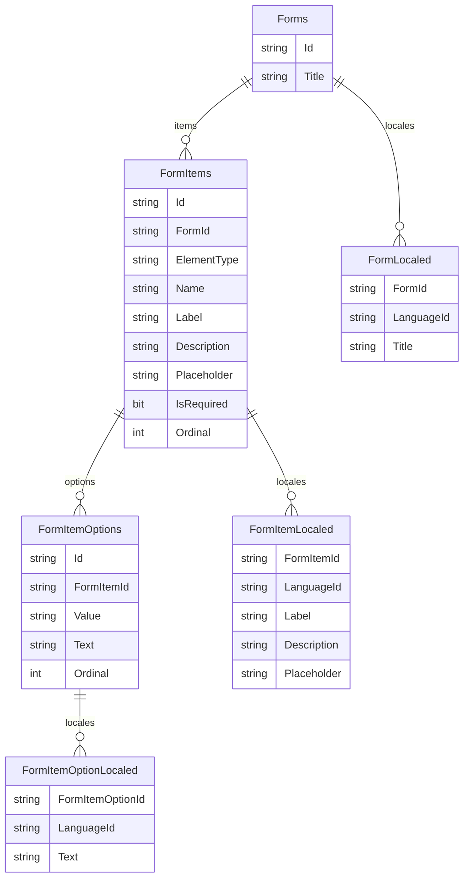

# Sample formbuilder api

Please see with [bbonkr/sample-react-formbuiler](https://github.com/bbonkr/sample-react-formbuiler)

## Entities



## Migrations

```bash
$ dotnet new tool-manifest
$ dotnet tool install dotnet-ef --local
```

### Migrations add

```bash
$ cd src/FormBuilder.Data
$ dotnet ef migrations add "Initialize" --startup-project ../FormBuilderApp --project ../FormBuilder.Data.SqlServer
```

